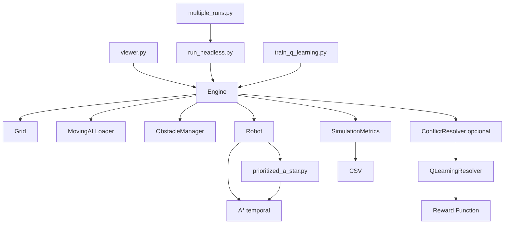

# Arquitetura do sistema

Este documento explica a arquitetura do **MAPF Smart Warehouse**, os módulos principais e o fluxo de funcionamento da simulação.

---

## 1. Visão geral

O projeto está organizado em camadas:

```text
Entrada / Execução
    viewer.py
    run_headless.py
    multiple_runs.py
    train_q_learning.py

Motor de simulação
    environment/engine.py

Ambiente
    environment/grid.py
    environment/loader.py
    environment/obstacles.py
    environment/multi_robot.py

Agentes e planeamento
    agents/robot.py
    agents/a_star.py
    agents/prioritized_a_star.py

Resolução de conflitos
    agents/conflict_resolution/

Métricas
    metrics/events.py
    metrics/simulation_metrics.py
```

O `Engine` é o centro da arquitetura. Ele coordena robôs, obstáculos, conflitos, replanning, eventos e métricas.

---

## 2. Diagrama lógico



---

## 3. Responsabilidades por módulo

### `environment/grid.py`

Representa o mapa como grelha 2D.

Responsabilidades:

- guardar largura e altura;
- indicar se uma célula está dentro dos limites;
- indicar se uma célula é caminhável;
- devolver vizinhos ortogonais;
- marcar ou remover obstáculos estáticos.

Convenção:

```text
posição = (x, y)
x = coluna
y = linha
cells[y][x]
```

---

### `environment/loader.py`

Carrega mapas no formato MovingAI e transforma caracteres do ficheiro numa `Grid`.

Caracteres bloqueados:

```text
@ O T #
```

---

### `environment/obstacles.py`

Gere obstáculos estáticos e dinâmicos.

Obstáculos dinâmicos têm duração temporária. A cada tick, o `ObstacleManager.tick()` reduz o tempo restante e remove obstáculos expirados.

A função mais importante é:

```python
spawn_random_dynamic(count=10, duration_range=(5, 15), avoid_positions=...)
```

Ela cria obstáculos temporários em células livres, evitando posições proibidas como starts/goals dos robôs quando fornecidas.

---

### `environment/multi_robot.py`

Cria múltiplos robôs automaticamente.

Estratégia usada:

- parte dos robôs nasce numa zona lateral do mapa e tem destino no lado oposto;
- isto provoca cruzamentos e congestionamento;
- origens e destinos repetidos são evitados;
- apenas robôs com caminho inicial válido são aceites.

---

### `agents/robot.py`

Representa um robô individual.

Um robô guarda:

- `robot_id`;
- `start`;
- `goal`;
- `current_position`;
- `path`;
- índice atual no caminho;
- passos executados;
- número de replans;
- estado de bloqueio;
- última ação/recompensa.

O robô sabe planear e executar o seu caminho, mas **não resolve conflitos globais**. Essa responsabilidade pertence ao `Engine`.

---

### `agents/a_star.py`

Implementa A* numa grelha expandida no tempo.

Estado de pesquisa:

```text
((x, y), t)
```

O algoritmo considera:

- movimentos para cima, baixo, esquerda e direita;
- ação de espera;
- obstáculos da grelha;
- restrições de vértice;
- restrições de aresta.

A heurística é a distância de Manhattan.

---

### `agents/prioritized_a_star.py`

Fornece a interface do planner usado nos modos `prioritized` e `qlearning`.

Este módulo delega a pesquisa ao A* temporal. A lógica de prioridade e resolução de conflitos está principalmente no `Engine`.

---

### `environment/engine.py`

É o motor central do simulador.

Responsabilidades:

- carregar o mapa;
- criar a grelha combinada com obstáculos dinâmicos;
- adicionar e remover robôs;
- planear caminhos iniciais;
- executar ticks;
- calcular intenções de movimento;
- resolver conflitos;
- aplicar waits, yields e replans;
- atualizar obstáculos;
- detetar colisões;
- emitir eventos;
- atualizar métricas;
- fornecer feedback ao Q-learning.

O método principal é:

```python
step()
```

Cada chamada a `step()` representa um tick da simulação.

---

### `agents/conflict_resolution/`

Contém a interface e implementação das políticas locais de resolução de conflitos.

Ficheiros principais:

| Ficheiro | Função |
|---|---|
| `actions.py` | Define `WAIT`, `YIELD` e `REPLAN`. |
| `context.py` | Define a observação enviada ao resolvedor. |
| `base.py` | Define a interface abstrata `ConflictResolver`. |
| `q_agent.py` | Implementa Q-learning tabular. |
| `rewards.py` | Calcula recompensas para treino. |

---

### `metrics/events.py`

Define eventos emitidos pelo `Engine`, como:

- início de simulação;
- fim de simulação;
- tick;
- spawn de robô;
- espera;
- replan;
- colisão;
- conclusão de objetivo.

---

### `metrics/simulation_metrics.py`

Agrega métricas a partir dos eventos.

O `SimulationMetrics` é passivo: ele não decide nada, apenas observa eventos e calcula estatísticas.

---

## 4. Fluxo de uma simulação

Fluxo simplificado:

```text
1. Runner ou viewer cria Engine.
2. Engine carrega o mapa.
3. Obstáculos dinâmicos são criados.
4. Robôs são criados e adicionados ao Engine.
5. Cada robô recebe um caminho inicial.
6. A simulação começa.
7. A cada tick:
   a. robôs indicam a próxima posição pretendida;
   b. Engine resolve conflitos;
   c. Q-learning decide WAIT/YIELD se estiver ativo;
   d. movimentos são executados;
   e. obstáculos dinâmicos expiram;
   f. colisões são detetadas;
   g. eventos são emitidos;
   h. métricas são atualizadas.
8. A simulação termina quando todos chegam ou quando atinge max_ticks.
9. Resultados são apresentados ou gravados em CSV.
```

---

## 5. Modos de planeamento

### `astar`

Cada robô planeia individualmente.

O `Engine` não impede conflitos entre robôs neste modo. Se dois agentes ocuparem a mesma célula, a colisão é registada depois do movimento.

Este modo serve para demonstrar que A* simples não basta para MAPF seguro.

---

### `prioritized`

Mantém o A* como planner, mas ativa coordenação determinística no `Engine`.

O `Engine` passa a:

- priorizar robôs bloqueados há mais tempo;
- impedir vários robôs de irem para a mesma célula;
- reduzir trocas frontais;
- aplicar espera;
- tentar cedências laterais;
- fazer replanning em bloqueios persistentes.

---

### `qlearning`

Mantém o mesmo A* base do modo priorizado, mas adiciona um `QLearningResolver`.

Quando um robô fica bloqueado, o resolvedor decide:

```text
WAIT  → esperar
YIELD → tentar ceder passagem para uma célula lateral segura
```

A ação `REPLAN` fica sob controlo determinístico do `Engine`, não do Q-learning.

Esta decisão foi tomada para evitar “replan storms”, isto é, excesso de replaneamentos provocados por uma política aprendida demasiado agressiva.

---

## 6. Resolução de conflitos

O `Engine` começa por recolher intenções:

```text
robot_id -> (posição_atual, posição_pretendida)
```

Depois decide que robôs podem avançar.

Critérios simplificados:

- evitar dois robôs no mesmo destino;
- evitar entrar numa célula ocupada por quem não se move;
- evitar swaps diretos;
- favorecer robôs bloqueados há mais tempo;
- usar `robot_id` como desempate.

Robôs não autorizados entram na lista de bloqueados.

---

## 7. Yield

`YIELD` significa ceder passagem através de um movimento lateral seguro.

O `Engine` procura uma célula candidata que:

- esteja dentro do mapa;
- seja caminhável;
- não tenha obstáculo dinâmico;
- não esteja ocupada;
- não seja alvo de outro robô no mesmo tick;
- não agrave conflitos futuros imediatos.

Após um yield manual, o robô é replaneado a partir da nova posição.

---

## 8. Replanning

O replanning é usado quando:

- a próxima célula ficou bloqueada;
- o robô ficou sem próximo passo;
- há deadlock persistente;
- um swap em corredor estreito não consegue ser resolvido por yield.

O método central é `_replan_robot()`, que garante que o evento `ROBOT_REPLAN` é emitido e que as métricas ficam sincronizadas.

---

## 9. Métricas e eventos

O `Engine` emite eventos; `SimulationMetrics` agrega.

Isto evita misturar a simulação com a análise dos resultados.

Exemplo:

```text
Engine executa movimento → emite evento ROBOT_WAIT → SimulationMetrics incrementa wait_count
```

---

## 10. Decisões arquiteturais importantes

### Q-learning não planeia caminhos

A decisão final foi limitar o Q-learning a decisões locais. Isto torna a política mais estável e mais fácil de justificar no relatório.

### A* simples não evita colisões

Isto é intencional. Ele serve como baseline ingênuo.

### `safe_success` é mais importante que `completion_rate`

Um algoritmo pode ter `completion_rate = 1.0` e mesmo assim ser inseguro se existirem colisões.

### `dynamic_obstacles_final = 0` não significa ausência de obstáculos

Os obstáculos dinâmicos expiram. A coluna relevante para configuração é `dynamic_obstacles_requested`.
